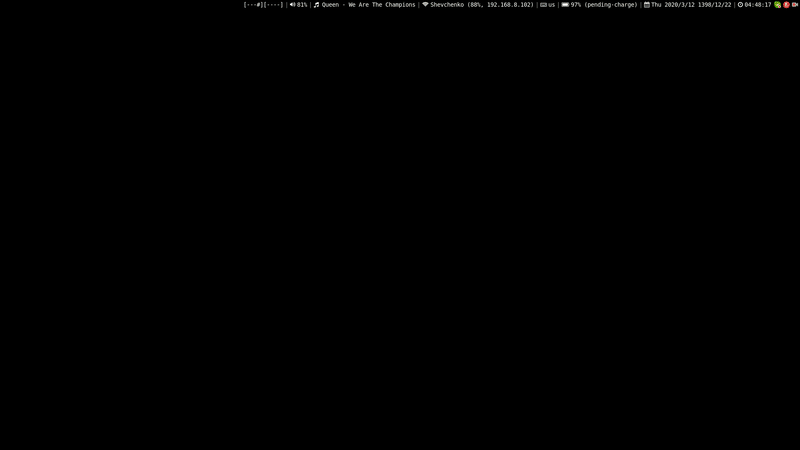

# dotfiles
This is my custom dotfiles based on `i3`.

## Screen Capture:

## Features:
[x] Grid Workspace
[x] Jalali Date
[x] Custom Lock page
[x] Take Care of `autostart` Apps
[x] GUI Menu for Network
[x] GUI Menu for Sound Menu
[x] GUI Menu for Power Options
[x] GUI Menu for Playback Control
[x] GUI Menu for Keyboard Layouts
[x] GUI Menu for Taking Screenshot

## Dependencies:
- `i3` of course you need that
- `rofi` for creating gui menu
- `i3blocks` for panel
- `i3lock` for lock
- `scrot` for taking screenshot
- `nodejs` base language of node-scripts
- `wicd`, `wicd-cli` for managing networka
- `qdbus` to communicate with media player
- `amixer` to manage sound card
- `jq` to parse json files
- `htop` to monitor system

## How to Use
Just make sure you already installed dependencies on your machine, then just place `/config` files into your `~/.config` folder and restart your `i3`.

## Shortcuts
- `$mod+d` Appfinder Menu
- `$mod+l` Power Options Menu
- `$mod+i` Network Manager Menu
- `$mod+o` Sound Menu
- `$mod+k` Keyboard Layout Menu
- `$mod+space` Switch Keyboard Layout
- `$mod+t exec` Open Terminal
- `$mod+h` Open System Monitor
- `$mod+p` Screenshot Menu
- `$mod+m` Media Player Control Menu
- `$mod+q` Kill Focused Window
- `$mod+Ctrl+Left` Go Workspace Left
- `$mod+Ctrl+Right` Go Workspace Right
- `$mod+Ctrl+Up` Go Workspace Up
- `$mod+Ctrl+Down` Go Workspace Down
- `$mod+Ctrl+Shift+Left` Move Focused Window to Workspace Left
- `$mod+Ctrl+Shift+Right` Move Focused Window to Workspace Right
- `$mod+Ctrl+Shift+Up` Move Focused Window to Workspace Up
- `$mod+Ctrl+Shift+Down` Move Focused Window to Workspace Down
